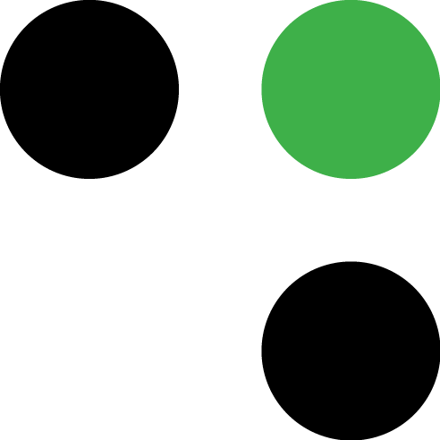

<h1 align="center">
  <br>
  
  <br>
  Grey Matter Fabric Dashboard
  <br>
</h1>

<h4 align="center">An administrative UI for distributed systems built with the <a href="http://deciphernow.com/grey-matter#fabric" target="_blank">Grey Matter Fabric</a> microservice framework.</h4>

<p align="center">
  <a href="https://github.com/prettier/prettier" target="_blank">
    
  </a>
  <a href="https://www.styled-components.com/" target="_blank"></a>
  <a href="https://circleci.com/gh/DecipherNow/gm-fabric-dashboard/tree/master" target="_blank"></a>
  <a href="https://codeclimate.com/github/DecipherNow/gm-fabric-dashboard/maintainability" target="_blank"></a>
  <a href="https://codeclimate.com/github/DecipherNow/gm-fabric-dashboard/test_coverage" target="_blank"></a>
  <a href="https://opensource.org/licenses/mit-license.php" target="_blank"></a>
  <a href="https://david-dm.org/deciphernow/gm-fabric-dashboard" target="_blank"></a>
</p>

<p align="center">
  <a href="#demo">Demo</a> •
  <a href="#quick-start">Quick Start</a> •
  <a href="#further-resources">Further Resources</a> •
  <a href="#related-projects">Related Projects</a> •
  <a href="#license">License</a>
</p>

## Demo


## Quick Start

#### 1. If you do not already have Node.js 8.x LTS installed, <a href="https://nodejs.org/en/download/" target="_blank">download and install it</a>

You can check your currently installed Node.js runtime by running the command `node -v`

#### 2. Install and start the GM Fabric Dashboard with a mock of the backend API

From the command-line interface, navigate to the directory where you would like to install the dashboard and run the following commands to install the app and start the dashboard in development mode running against a mock of the server-side API running locally on your machine.

```
git clone https://github.com/DecipherNow/gm-fabric-dashboard.git
cd gm-fabric-dashboard
npm install
npm start
```

Once the project has compiled, the dashboard will lauch at [http://localhost:3000](http://localhost:3000) and open in your browser.

You can open the source code in your editor of choice, and the page will reload if you make edits.

Note: Git will notice changes to the `fabricServer` metatag in your `index.html` file. These changes are caused by npm scripts and can be safely ignored. If staged for a commit, git hooks will check to make sure that this value is pristine in the commit and then immediately revert the value back to `localhost:1337`. Additionally, you may notice the generation of an `.isRunning` placeholder file in your project root. This file is used by the `npm scripts` and is in the `.gitignore` file.

## Further Resources

If you are a developer interested in contributing to this project, please refer to our [Contribution Guide](./CONTRIBUTING.md).

If you are a general user interested in exploring the features of this software, please refer to our [User Guide](./docs/overview.md) to learn more about the features of this software.

If you are a systems administrator and wish to install this software with live metrics and microservices, please refer to our externally-hosted [Grey Matter Fabric documentation site](http://www.deciphernow.com/)

## Related Projects

* [Grey Matter Fabric JVM SDK](https://github.com/DecipherNow/gm-fabric-jvm)
* [Grey Matter Fabric Go SDK](https://github.com/DecipherNow/gm-fabric-go)
* [Grey Matter Fabric Passthrough Agent](https://github.com/DecipherNow/gm-fabric-jvmagent)

## License

MIT
